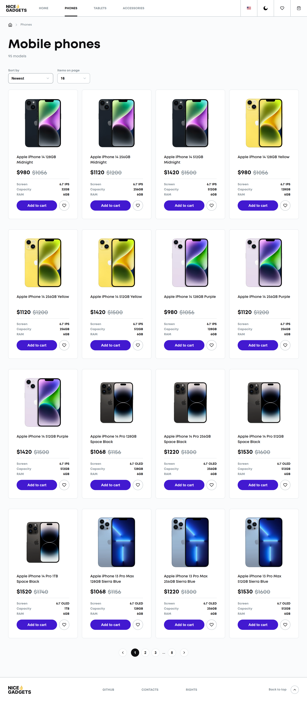
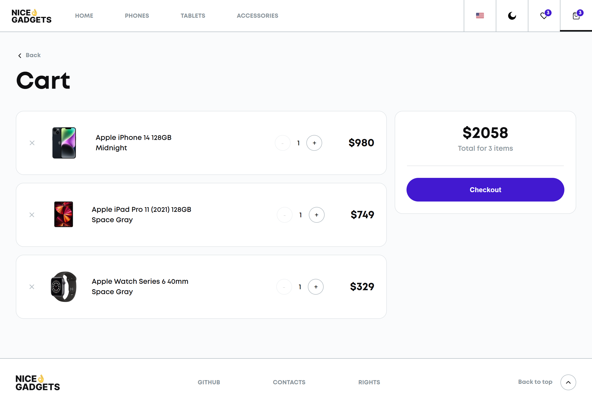

# 📱 NiceGadgets Store

A fully functional e-commerce application designed for browsing and purchasing electronic devices. This Single Page Application (SPA) features a dynamic product catalog, shopping cart logic, and a seamless user experience similar to Apple's design aesthetics.

## Live Demo

Experience the live website: [NICEGADGETS Demo](https://vnechepurenko2005.github.io/nicegadgets_store/)

## Screenshots 📸

| Home Page | Catalog |
|:---------:|:-------:|
|  |  |
| **Product Details** | **Shopping Cart** |
|  |  |

## Design

Link to the design mockup: [Figma](https://www.figma.com/design/AeYdgRy7pQw62AiFosKmlY/Phone-catalog--V2--Rounded-Style-1?node-id=0-1&t=dhHslK5Wh3WrHwTQ-1)

## Technologies Used💻

### Core & Frameworks
* **React** – Component-based UI library for building the interface
* **TypeScript** – Type safety and logic
* **SCSS** (Sass) – Modular styling with mixins and variables
* **HTML5** – Semantic structure

### Application Logic
* **React Router** – Client-side routing for seamless page navigation
* **Redux Toolkit** – Efficient state management
* **Fetch** – Data fetching from local JSON or API
* **Local Storage** – Persisting user data (Cart, Favorites items) after page refresh

### UI/UX
* **CSS Modules** – Scoped styling to prevent conflicts
* **Responsive Design** – Adaptive layout for Mobile, Tablet, and Desktop
* **Animations** – Smooth transitions and hover effects

### Development
* **Git** – Version control
* **NPM** – Package manager
* **Eslint & Prettier** – Code quality and formatting

## Get Started

1. Clone the repository:
```bash
git clone https://github.com/vnechepurenko2005/nicegadgets_store.git
cd nicegadgets_store
```
2. Install dependencies:
```bash
npm install
# or
yarn install
```
3. Run the project locally:
```bash
npm start
# or
yarn start
```

## Features ✨

* **Product Catalog**: Dynamic rendering of phones, tablets, and accessories.
* **Filtering & Sorting**: Sort products by price, age, or name; filter by categories.
* **Product Details**: Dedicated pages for each item with specs, photos, and descriptions.
* **Shopping Cart**: Add/remove items, calculate totals, and persist cart state on reload.
* **Favorites**: Ability to mark items as "favorites" for quick access.
* **Pagination**: User-friendly navigation through large lists of products.
* **Breadcrumbs**: clear navigation path for better UX.
* **Interactive UI**: Custom sliders, loaders, and interactive buttons.

## Author ✒️

* **Vladyslav Nechepurenko** – [GitHub Profile](https://github.com/vnechepurenko2005)
